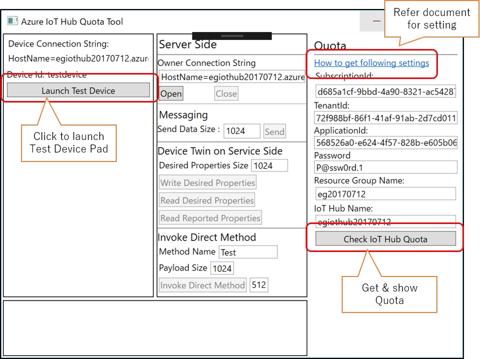
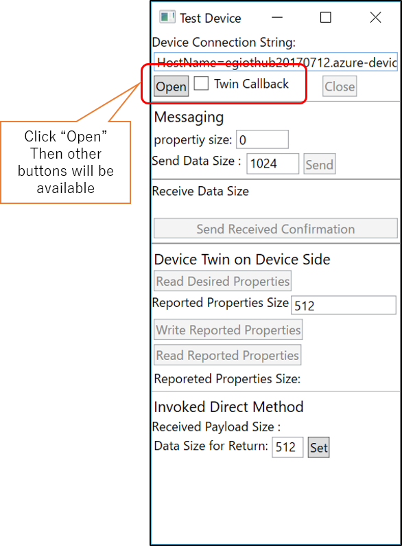
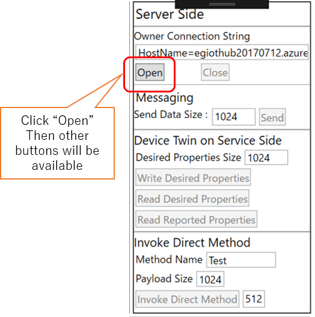

# Azure IoT Hub Monitoring 
## Setup 
Specify parameters in MainPage.xaml. 
```cs
        // for getting IoT Hub Quato
        string applicationId = "<< your application-id >>";
        string subscriptionId = "<< your subscription-id >>";
        string tenantId = "<< your tenant-id >>";
        string password = "<< your password >>";
        string resourceGroupName = "<< resource group name for IoT Hub >>";
        string iotHubName = "<< IoT Hub Name >>";

        string ownerConnectionString = "HostName=<< IoT Hub Name >>.azure-devices.net;SharedAccessKeyName=iothubowner;SharedAccessKey=<< Share Access Key for iothubowner >>";
        string deviceConnectionString = "HostName=<< IoT Hub Name >>.azure-devices.net;DeviceId=<< DeviceId >>;SharedAccessKey=<< Shared Access Key for DeviceId >>";
        string deviceId = "<< Device Id >>";
```
reference [https://docs.microsoft.com/azure/iot-hub/iot-hub-rm-rest](https://docs.microsoft.com/azure/iot-hub/iot-hub-rm-rest)  

## Feature 
MainPage. 
 

Test Device Pad. 
 

Service Pad. 
 
